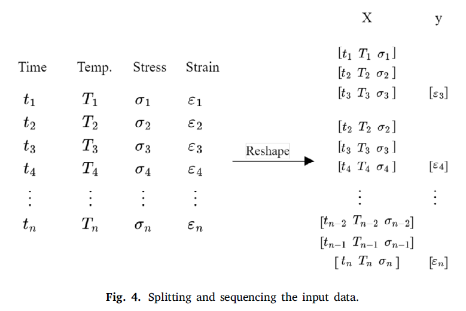

- **Deep learning for predicting the thermomechanical behavior of shape
memory polymers**
 **[`Elsevier 2022`]** *Diego Segura Ibarra, Jacob Mathews, Fan Li, Hongfang Lu, Guoqiang Li, Jinyuan Chen* [( Polymer)](https://www.sciencedirect.com/science/article/abs/pii/S0032386122008825) [(pdf)](./paper-pdf/Polymer%20paper.pdf) [(citation-SEGURAIBARRA2022125395)](./../citation_articles.md)

 - **Keywords and abstract**:
    - Shape memory polymers (SMP).
    - Thermomechanical constitutive modeling
    - To predict the Thermomechanical Behavior of SMPs using Deep Learning (Develop new thermomechanical models for SMPs).
    - Example ploymer: Semicrystalline two-way shape memory polymer (2W-SMP)
    - To know the SMP properties and validate its characteristics.
    - To find the best DL model that can predict the experiemntal thermomechanical behavior with the highest accuracy within a reasonable time frame. (FCNN and CNN were most accurate).
    - The trained model can predict the results of new iterations of the experiment.

- **Shape memory Polymers**
    - Smart materials capable of returning from a deformed shape to their original shape in response to temperature, electric field, or magnetic field.
    - Need to design new SMPs with better properties but it is difficult and time consumming because of trial and error process.

- **Thermomechanical behavior**
    - Thermomechanical behavior or thermomechanical constitutive law is not only critical for validating newly designed SMPs, it is also essential for designing load carrying structures and devices made of SMPs.

- **Background**
    - To assist in the polymer discovery process by reducing the time needed to validate newly designed SMPs.
    - To validate newly designed SMP, the researhcers need to verify whether the polymers have the desired characteristics.
    - Validate through recoverable strain and stress levels of the polymer.
    - A technique to evaluate the properties is the thermomechanical analysis (TMA).
    - **Thermomechanical Analysis (TMA)** the change in stress and strain of a material is measured in response to time, temperature and external load.
    - How the polymer will respond to different conditions and estimate the change in strain of a SMP without performing experimental TMA.
    - There was lack of predict the research of using ML to predict the thermomechanical behavior of SMPs.

- **Objective**
    - The objective is to predict the change in strain of an SMP as a function of time, temperature, and external load (stress).
    - Since the variable to be predicted is a time dependent variable, DL models for time series forecasting are suitable to make the prediction.

-**Dataset**
    - Data obtained from the TMA of crosslinked cis polybutadiene (cPBD) is divided into **2 datasets**. It includes: stress and temperature (these are controlled variables, are determined before performing TMA), and strain (depends on the changes of stress and temperature over time).
    - **INPUTS** controlled variables: time, temperature, and stress.
        - **Format of Input: splitting and sequencing** time, temperature and stress values at that moment, the historical values of time, temperature and stress values that led up to that moment must also be provided.

  

  
  

        - The number of instances present in each sequence is labeled as n.
        - Splitting the data as such, removes some of the initial output values. if three instances are used (like in Fig. above), then the first input will have the first three instances of time, temperature, and stress values, and the output would be the strain value corresponding to the third instance of time, temperature, and stress.

        - **Risk of choosing large n:** choosing a large n runs the risk of forgetting many initial strain values.
        - each DL model used a different n. 

    - **OUTPUTS** strain

